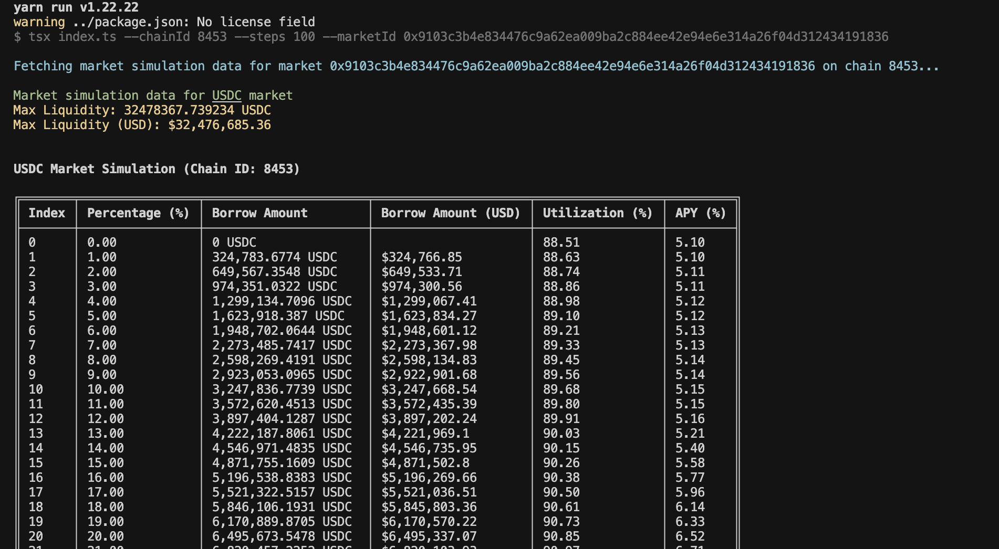

# Morpho Borrow Simulator

A developer tool for simulating borrowing scenarios in Morpho Blue markets. Visualize how different borrowing amounts affect utilization metrics and APY rates.



## Important Notes

- Those scripts are for educational purposes only.
- It is not expected that the contributor(s) of this repository will be available to provide more support.
- The code is not optimized for performance and could be improved.
- There might be aslight difference between this code results and the future Front-End computation as the internal algo might be subject to changes.

## What This Tool Does

This simulator helps you:

- Preview borrowing rates before executing transactions
- Understand how different borrow amounts affect market utilization
- Plan large borrowing operations to optimize for rates

## Quick Start

### Prerequisites

- Node.js 16+
- Yarn

### Setup

1. Clone this repository

```bash
git clone <repository-url>
cd <repository-directory>
```

2. Install dependencies

```bash
yarn install
```

3. Set up your RPC URLs

```bash
cp .env.example .env
```

Then edit `.env` with your RPC endpoints:

```
RPC_URL_MAINNET=https://your-ethereum-rpc-url
RPC_URL_BASE=https://your-base-rpc-url
```

### Run the Simulator

Basic usage:

```bash
yarn start
```

This runs with default settings (Base network, default market).

### Command Options

**Simulate on Ethereum Mainnet:**

```bash
yarn start --chainId 1 --marketId 0xc84cdb5a63207d8c2e7251f758a435c6bd10b4eaefdaf36d7650159bf035962e
```

**Simulate on Base with more granular data:**

```bash
yarn start --chainId 8453 --steps 100 --marketId 0x9103c3b4e834476c9a62ea009ba2c884ee42e94e6e314a26f04d312434191836
```

## Understanding the Output

The simulator displays:

- Market token and current liquidity
- Table showing data points with:
  - Borrow amount (in token and USD)
  - Resulting utilization percentage
  - APY at that utilization level

## How It Works

The tool fetches real-time data from Morpho Blue's API, including:

- Current market state
- Token information
- Price data

It then simulates different borrowing scenarios and calculates the resulting metrics.

## License

See LICENSE file
